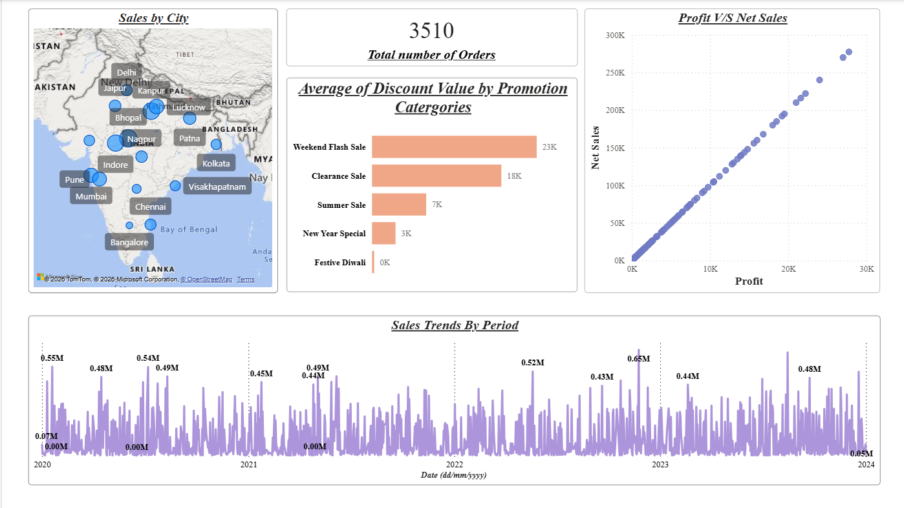

# ElectroHub Sales & Profit Analytics Dashboard

An interactive Power BI dashboard developed to analyze sales,
profitability, product performance, customer activity, discounts,
promotions, and geographical sales performance.

## Dashboard Preview

## Tools & Technologies

- Power BI
- Power Query
- DAX
- Microsoft Excel

## Key Analysis

The dashboard provides insights into:

- Top and Bottom 5 products by Sales
- Top and Bottom 5 products by Profit
- Top and Bottom 5 products by Quantity Sold
- Sales trends over time
- Relationship between Sales and Profit
- Comparison between two user-selected periods
- Average discount by discount category
- Total number of orders
- Sales, Profit, Discount and Net Sales by order
- Sales by different cities
- Product, Date, Customer and Promotion filtering

## Dashboard Features

### Product Performance
Analyzes the highest and lowest performing products
based on sales, profit and quantity sold.

### Time-Based Analysis
Provides daily, monthly, quarterly and yearly sales trends.

### Sales & Profit Analysis
Shows the relationship between sales and profit
to evaluate business performance.

### Discount Analysis
Analyzes average discounts across different
discount categories.

### Geographic Analysis
Shows sales performance across different cities.

### Interactive Filtering
Users can filter the dashboard by:

- Product
- Date
- Customer ID
- Promotion Category

## Dataset

The project uses an Excel-based retail sales dataset
containing customer, product, promotion and transaction data.

## Files

- `ElectroHub.pbix` — Power BI project file
- `ElectroHub.pdf` — Dashboard report
- `Dashboard.png` — Dashboard preview
- `README.md` — Project documentation
